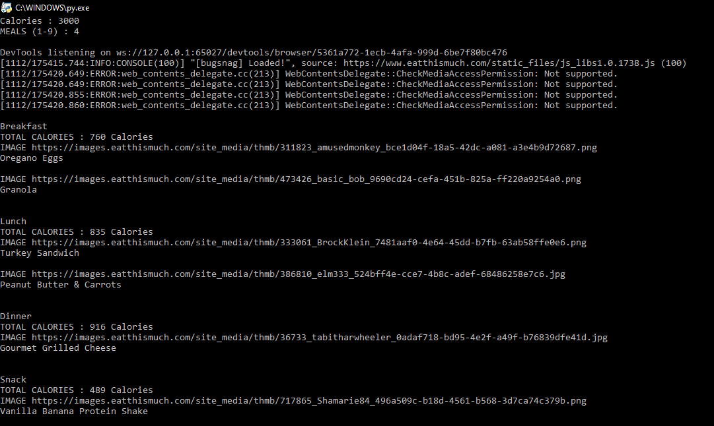

# EatThisMuch Scraper
 
# PREQUISITES
  ## PIP DEPENDENCY
   * selenium : install selenium
     `pip install selenium`

  ## GOOGLE CHROME BROWSER
   * download Google Chrome from [here](https://www.google.com/chrome/ "Google Chrome")

  ## SELENIUM WEBDRIVER FOR CHROME
   * Firstly find the version of your Google Chrome Browser
     * Settings > Advanced > About Chrome
       Note down the chrome version Example `78.0.3904.97`
   * Go to [Chrome Driver Downloads](https://chromedriver.chromium.org/downloads "Chrome Driver") and download the driver   that matches your Browser version

# INSTRUCTIONS
 * Open `main.py` in an appropriate text editor and replace the `executable_path` in line 16 `driver = webdriver.Chrome(executable_path=r"C:\Users\Rahul\PaidProjects\Personal\GrayBot-Uv1\chromedriver.exe",options=options)` to the one that matches the chromedriver.exe on your system
 * Now you can simply run the code on the console by typing `python main.py`

# OUTPUT
 